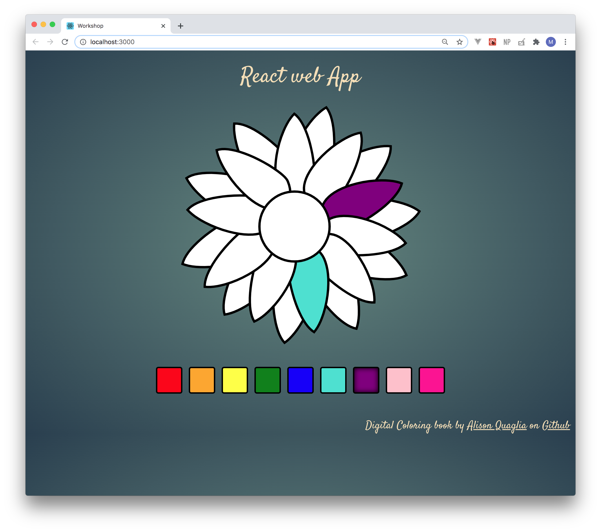

## Example of React Web Application

##### Install dependencies

`yarn install`

##### Run Snap Shot from the root directory

`yarn start`

##### Build the image  

`docker build -t workshop:latest .`

##### Run the container locally

`docker run -it -p 8080:80 workshop:latest`

